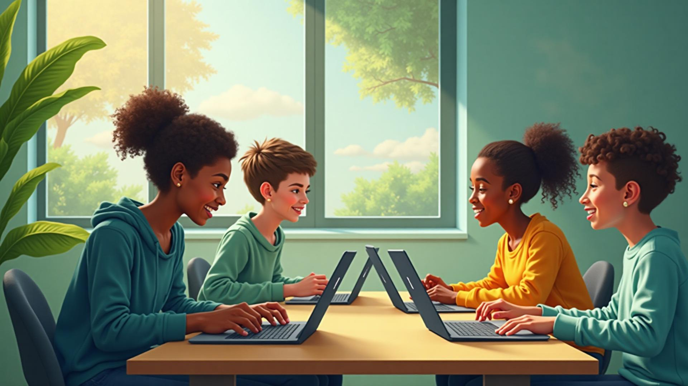
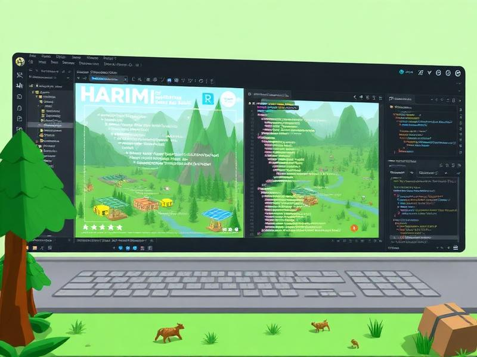
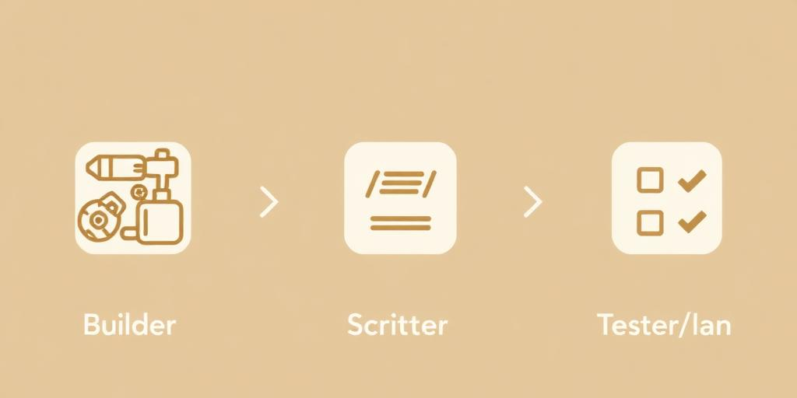

# Eco Blox — Learn & Create

<p align="left">
  <a href="https://vercel.com" target="_blank"></a>
  <a href="https://github.com/bhaveshpatil/EcoBlox/actions" target="_blank"></a>
  
</p>

An educational React + TypeScript web app that teaches students about environmental stewardship while creating experiences inspired by Roblox. The site showcases program highlights, student roles, safety information, and a welcoming hero section — all built with modern UI components and a responsive layout.

## Features

- Responsive landing page with `Hero`, `ProgramHighlights`, `StudentRoles`, `SafetySection`, `Navigation`, and `Footer`
- Accessible UI components powered by `shadcn/ui` and `Radix` primitives
- Utility-first styling with `Tailwind CSS`
- Fast dev experience with `Vite` and TypeScript

## Tech Stack

- React + TypeScript
- Vite
- Tailwind CSS
- shadcn/ui

## Getting Started

Prerequisites:
- Node.js 18+ (recommend using `nvm`)
- npm (or pnpm/yarn/bun)

Clone and run locally:
```sh
git clone <YOUR_REPO_URL>
cd EcoBlox
npm ci
npm run dev
```

Build for production:
```sh
npm run build
```

Preview the production build locally:
```sh
npm run preview
```

## Project Structure

```
eco-blox-learn-create-91-main/
  public/                # Static assets
  src/
    assets/              # Images used in the UI
    components/          # Reusable UI and sections
      ui/                # shadcn/ui components
    hooks/               # Custom React hooks
    lib/                 # Utilities
    pages/               # Route-level components
    App.tsx              # Root composition
    main.tsx             # Vite React entry
  index.html             # App HTML template
  tailwind.config.ts     # Tailwind config
  vite.config.ts         # Vite config
  package.json
```

## Screenshots & Media

Below are some media assets used within the app. You can embed these in your docs, issues, or PRs as needed.

Hero image:



Program visuals:




Section animations (from `public/`):


## Available Scripts

- `npm run dev`: Start the dev server (Vite)
- `npm run build`: Build the app for production (to `dist/`)
- `npm run build:dev`: Build in development mode
- `npm run preview`: Preview the built app locally
- `npm run lint`: Run ESLint

## Configuration

- Tailwind is configured via `tailwind.config.ts` and `src/index.css`.
- shadcn/ui components live under `src/components/ui`. Add new components with the same pattern for consistency.

## Deployment

This is a static Vite app. You can deploy the contents of `dist/` to any static host:
- Vercel
- Netlify
- GitHub Pages

Typical flow (example: Vercel):
1. Push to your GitHub repository
2. Import the repo in Vercel
3. Framework preset: Vite
4. Build command: `npm run build` — Output directory: `dist`

## Troubleshooting

- If the dev server doesn’t open automatically, visit `http://localhost:8080/` (port may vary).
- If port 5173 is expected but unavailable, Vite will pick another free port and print it in the terminal.
- If you see dependency issues, try reinstalling with `npm ci`.

## Contributing

1. Create a feature branch
2. Commit changes with clear messages
3. Open a pull request

## License

This project is licensed under the MIT License. See `LICENSE` (add one if missing).
